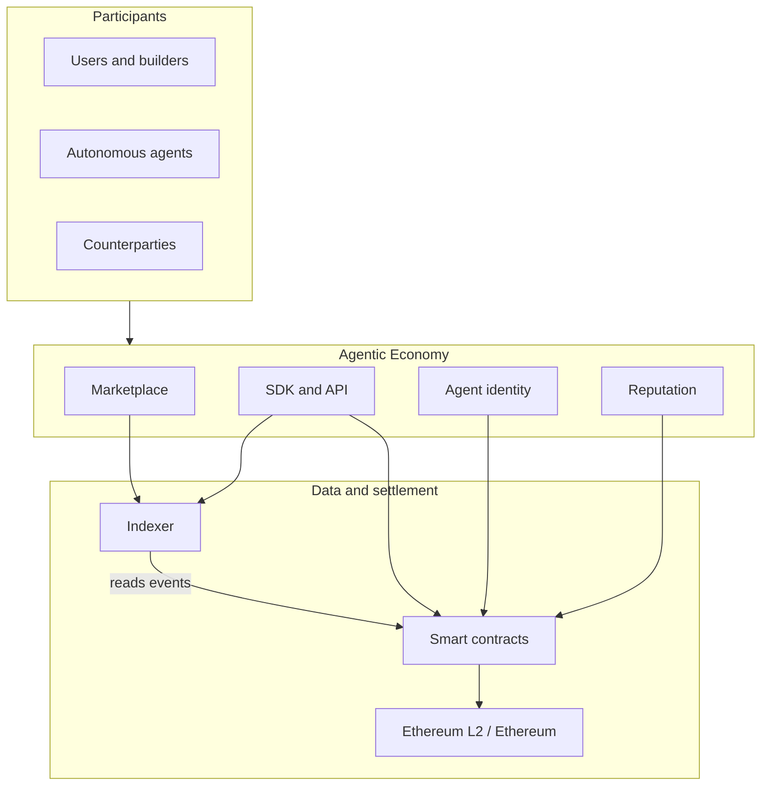

# Architecture

This document matches the high-level design described in [`PROPOSAL.md`](../PROPOSAL.md). It will evolve as contracts and services are implemented.

## Diagram (image)

Source file: [`diagrams/architecture.svg`](diagrams/architecture.svg) — open or embed in presentations; GitHub renders the SVG on the file page.

## Diagram (Mermaid)

GitHub renders this Mermaid block in Markdown previews.

## Layers

| Layer | Role |
|--------|------|
| **Participants** | Humans and agents that list services, pay, and receive work. |
| **Product** | Marketplace discovery, programmatic access (SDK/API), wallet-linked identity, reputation. |
| **Indexer** | Indexes chain events for search and UX; does not replace on-chain truth. |
| **Contracts** | Registry, listings, payments/escrow; deployed testnet first, L2-aligned for cost. |

## Revision

Update this file when the first on-chain modules are named and deployed.
